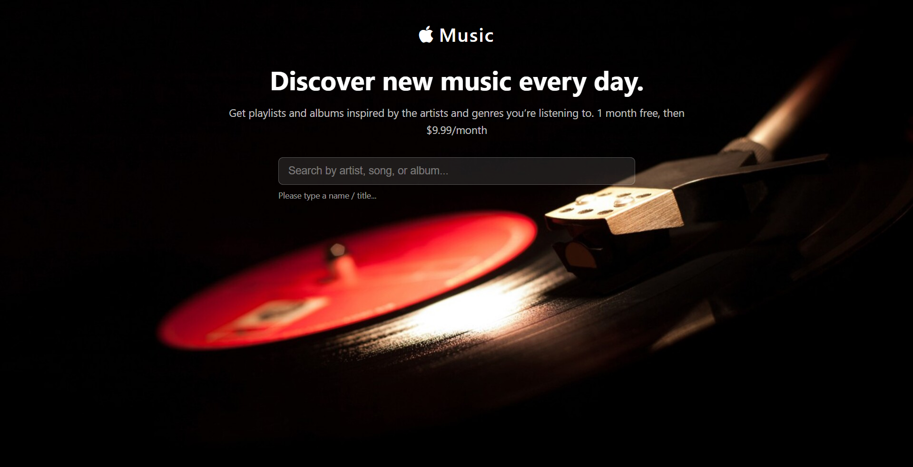
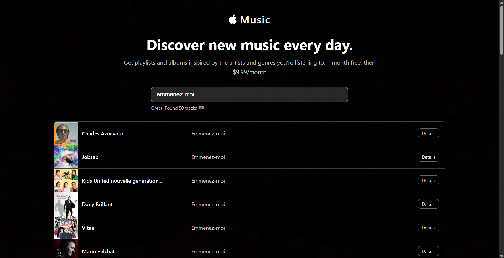
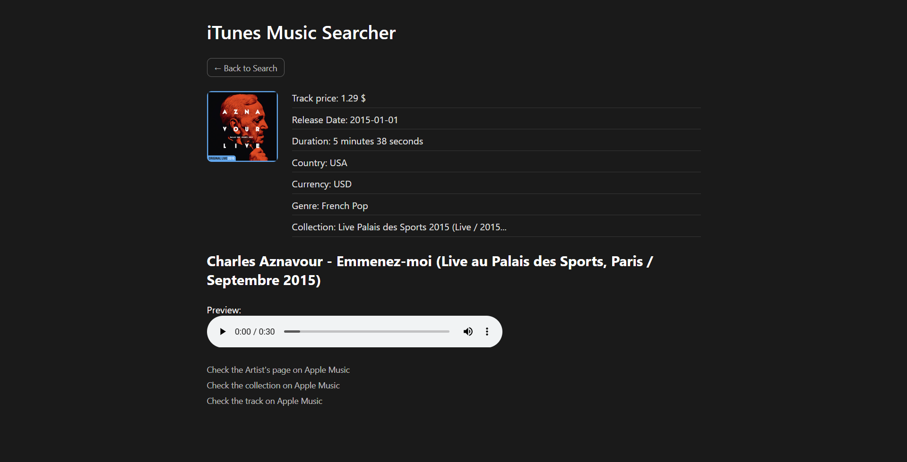

# iTunes Music Searcher

A responsive music search app built with React that lets users search the iTunes catalog in real time and explore detailed information about any track.

🔗 **Live demo:** [https://itunes-simple-clone-a7486.web.app](https://itunes-simple-clone-a7486.web.app)

---

## Screenshots







---

## About the App

Type any artist, song, or album name into the search bar and get up to 50 matching tracks from the iTunes API instantly. Click **Details** on any result to open a dedicated page showing the full track info — artwork, genre, album, release date, and a 30-second audio preview — then close it to return right back to your search.

### Features

- **Real-time search** with 400 ms debounce — no button needed
- **Track detail page** with high-resolution artwork (600×600) and audio preview
- **Smart navigation** — the Details page opens in a new tab and the Back button closes it, returning focus to the search tab
- **Fully responsive** — adapts cleanly to desktop, tablet, and mobile
- **No back-end** — all data comes directly from the public iTunes Search API

---

## Skills Practiced

| Area | Details |
|---|---|
| **React** | Functional components, hooks (`useState`, `useEffect`, `useParams`), conditional rendering |
| **React Router v6** | `BrowserRouter`, `Routes`, `Route`, `Link`, `useParams`, multi-page SPA |
| **API Integration** | `fetch` with the iTunes Search & Lookup API, `encodeURIComponent`, async state management |
| **CSS Architecture** | Design token system (`--clr-*`, `--fs-*`), `1rem = 10px` base, frosted-glass UI |
| **Responsive Design** | Mobile-first layout, three breakpoints (1080 px / 600 px / 480 px), no media-query orientation guards |
| **UX Patterns** | Debounced input, loading state, empty-state handling, `window.opener` / `window.close()` tab management |
| **Deployment** | Production build with Create React App, hosted on Firebase Hosting |

---

## Tech Stack

- React 18 · Create React App
- React Router DOM v6
- iTunes Search API (public, no key required)
- Plain CSS (custom properties, no framework)
- Firebase Hosting

---

## Getting Started

### Prerequisites

- Node.js ≥ 16
- npm ≥ 8

### Install & Run

```bash
git clone https://github.com/<your-username>/iTunes-music-Searcher.git
cd iTunes-music-Searcher
npm install
npm start
```

Open [http://localhost:3000](http://localhost:3000) in your browser.

### Build for Production

```bash
npm run build
```

The optimised bundle is output to the `build/` folder.
