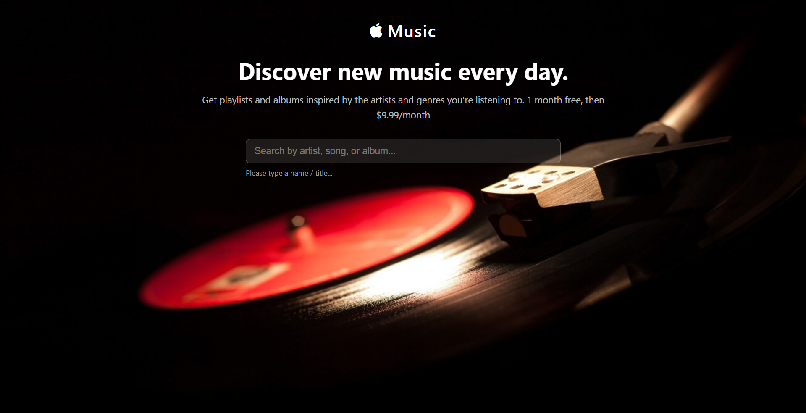
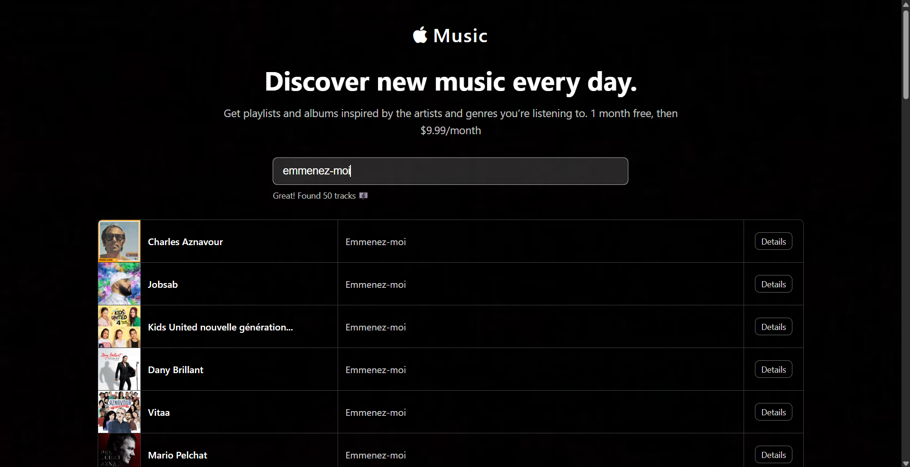
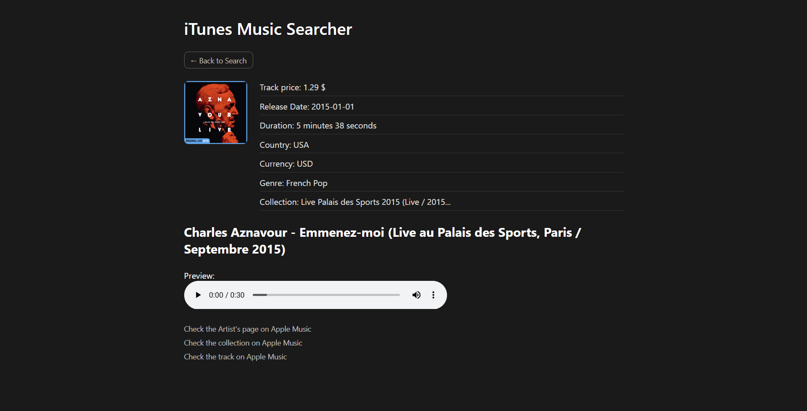

# iTunes Music Searcher

A modern, responsive music search app built with React 19 that lets you explore
the iTunes catalog in real-time. Features trending charts, instant search with
debouncing, pagination, and detailed track previews.

🔗 **Live demo:**
[https://itunes-simple-clone-a7486.web.app](https://itunes-simple-clone-a7486.web.app)

---

## Screenshots







---

## Features

- **Trending songs on load** — displays Apple Music's top 25 chart via iTunes
  RSS feed
- **Real-time search** with 400ms debounce — no search button needed
- **Pagination** — "Load More" fetches the next 50 results using the API's
  `offset` parameter
- **Track detail page** — high-res artwork (600×600), full metadata, and
  30-second audio preview
- **URL-driven search** — the search term lives in the URL (`?q=...`), so
  results survive navigation to a track and back, and can be shared or
  bookmarked
- **Skeleton loading states** — smooth visual feedback while fetching data
- **Error handling** — graceful error states with inline retry
- **In-app navigation** — track details open in the same tab; the back button
  returns to your exact search results
- **Fully responsive** — adapts from desktop down to mobile
- **No backend required** — all data comes directly from public Apple APIs

---

## Tech Stack

| Technology       | Version | Purpose                      |
| ---------------- | ------- | ---------------------------- |
| React            | 19      | UI framework                 |
| React Router     | 7       | Client-side routing          |
| Vite             | 6       | Build tool & dev server      |
| SCSS             | -       | Styling with variables       |
| iTunes API       | -       | Music data (no key required) |
| Firebase Hosting | -       | Deployment                   |

---

## Project Structure

```
src/
├── components/          # Reusable UI components
│   ├── ErrorBoundary.jsx
│   ├── Header.jsx
│   ├── SearchInput.jsx
│   ├── SongCard.jsx
│   ├── SongCardSkeleton.jsx
│   └── SongList.jsx
├── hooks/               # Custom React hooks
│   ├── useDebounce.js
│   ├── useTrackDetails.js
│   └── useTracks.js
├── pages/               # Page components
│   ├── HomePage.jsx
│   └── TrackDetailPage.jsx
├── services/            # API layer
│   └── itunes.js
├── styles/              # SCSS styles
│   ├── _base.scss
│   ├── _components.scss
│   ├── _pages.scss
│   ├── _variables.scss
│   └── index.scss
├── assets/              # Static assets
├── App.jsx              # Root component with routing
└── main.jsx             # Entry point
```

---

## Architecture Highlights

### Custom Hooks

- **`useTracks`** — manages URL-synced search state (`useSearchParams`),
  trending songs, pagination, and loading/error states
- **`useTrackDetails`** — fetches single track data with loading and error
  handling
- **`useDebounce`** — generic debounce hook for search input optimization

### Service Layer

- **`itunes.js`** — centralized API functions with proper error handling:
  - `fetchTrendingSongs()` — RSS feed for top 25
  - `searchTracks(term, offset)` — search with pagination
  - `fetchTrackById(id)` — single track lookup
  - Utility functions for formatting dates, durations, and artwork URLs

### Styling

- SCSS with design tokens (`_variables.scss`)
- BEM-like naming convention
- Responsive layout with `max-width` breakpoints (desktop → mobile)
- Skeleton loading animations

---

## Skills Demonstrated

| Area                  | Details                                                                                   |
| --------------------- | ----------------------------------------------------------------------------------------- |
| **React 19**          | Functional components, hooks (`useState`, `useEffect`, `useCallback`), custom hooks       |
| **React Router v7**   | `BrowserRouter`, `Routes`, `Route`, `Link`, `useParams`, `useNavigate`, `useSearchParams` |
| **API Integration**   | `fetch` with async/await, error handling, response normalization, pagination              |
| **Custom Hooks**      | Encapsulated business logic, reusable stateful logic                                      |
| **SCSS Architecture** | Variables, partials, `@use` modules, BEM naming                                           |
| **Build Tools**       | Vite configuration, production builds, asset handling                                     |
| **Error Handling**    | Error boundaries, graceful degradation, user-friendly messages                            |
| **UX Patterns**       | Debounced input, skeleton loaders, loading states, pagination                             |

---

## Getting Started

### Prerequisites

- Node.js ≥ 18
- npm ≥ 9

### Install & Run

```bash
git clone https://github.com/<your-username>/iTunes-music-Searcher.git
cd iTunes-music-Searcher
npm install
npm run dev
```

Open [http://localhost:3000](http://localhost:3000) in your browser.

### Build for Production

```bash
npm run build
```

The optimized bundle is output to the `dist/` folder.

### Preview Production Build

```bash
npm run preview
```

### Deploy

Builds the app and deploys it to Firebase Hosting in one step:

```bash
npm run deploy
```

Requires the [Firebase CLI](https://firebase.google.com/docs/cli) and a prior
`firebase login`.

---

## API Reference

This app uses two public Apple APIs (no authentication required):

- **iTunes Search API** — `https://itunes.apple.com/search`
- **iTunes Lookup API** — `https://itunes.apple.com/lookup`
- **iTunes RSS Feed** — `https://itunes.apple.com/us/rss/topsongs/limit=25/json`

---

## License

MIT
